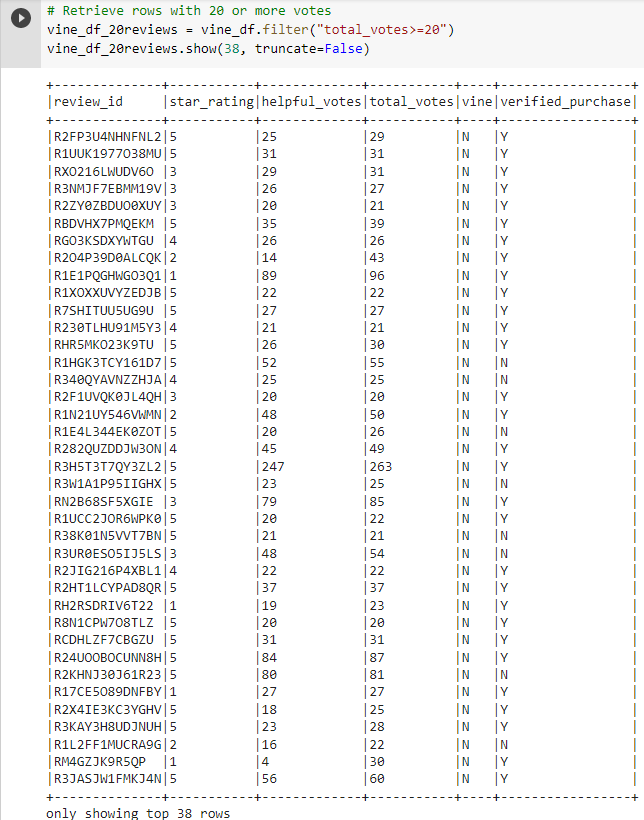
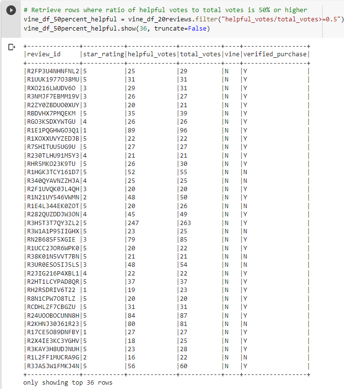
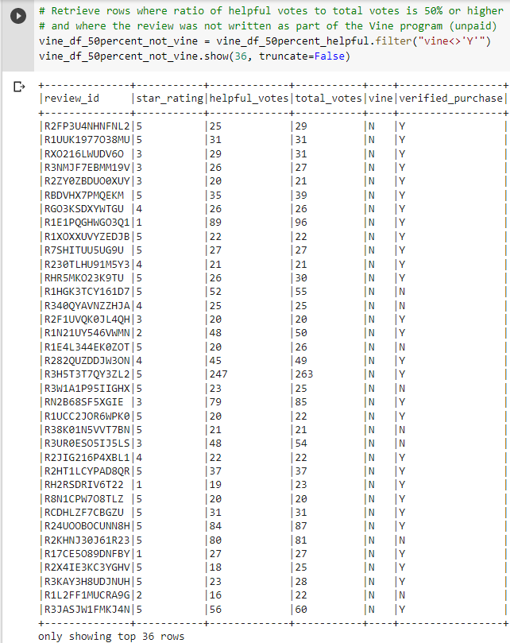
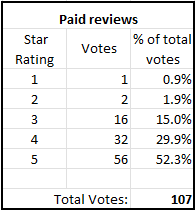
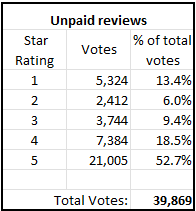

# Amazon_Vine_Analysis: Module 16
## Deliverable 1: Perform ETL on Amazon Product Reviews (40 points)
### (10 points) Here is the Amazon Review dataset extracted as a DataFrame

### (20 points) Extracted dataset transformed into four DataFrames
##### Customers Table:

##### Products Table:

##### Review ID Table:

##### Vine Table:

### (20 points) Four DataFrames loaded into respective tables in pgAdmin
###### Customers Table in pgAdmin (first 10 rows):

###### Products Table in pgAdmin (first 10 rows):

###### Review ID Table in pgAdmin (first 10 rows):

###### Vine Table in pgAdmin (first 10 rows):

## Deliverable 2: Determine Bias of Vine Reviews (40 points)
##### Filtered Vine table with 20 or more votes:

##### Filtered Vine table with 20 or more votes, and ratio of helpful votes to total votes is greater than or equal to 50%:

##### Filtered Vine table where review is paid (written as part of Vine program):

##### Filtered Vine table where review is unpaid (not written as part of Vine program):

##### Comparison of paid (Vine) reviews versus unpaid reviews:
  

The table on the left shows that there were 107 paid reviews that were part of the Vine program. Of these 107 reviews, 56, or 52.3%, were 5-star reviews.
The table on the right shows that there were 39,869 unpaid reviews. Of these 39,869 reviews, 21,005, or 52.7%, were 5-star reviews.
## Deliverable 3: A Written Report on the Analysis (20 points)
The purpose of this analysis was to analyze the results of reviews of Amazon's Outdoor dataset, comparing reviews of the paid Vine program with reviews submitted by unpaid reviewers.

To pick reviews that would be most helpful to the analysis, only reviews with 20 or more votes were initially considered for this study. These reviews were further filtered to eliminate reviews where the ratio of helpful votes to total votes was less than 50%.

This resulted in selecting 39,976 rows. Of these rows, 107, or 0.27%, were part of the Vine paid reviews. The remaining 39,869, or 99.73%, were unpaid reviews.

Of the 107 paid Vine reviews, 56 were 5-star reviews, for a percentage of 52.3%. Of the 39,869 unpaid reviews, 21,005 were 5-star reviews, for a percentage of 52.7%.

Based on the data above, there does not appear to be any positivity bias for reviews in the Vine program. The difference in the percentages is less than 0.5%.
We observe bigger apparent differences in percentages of negative reviews, 1- or 2-star reviews. Of the 107 paid Vine reviews, only 3 out of the 107 were 1- or 2-star reviews, for a percentage of 2.7%. Of the 39,869 unpaid reviews, a significantly higher percentage, or 19.4%, were 1- or 2-star reviews.

We would recommend an additional analysis to determine if there is a significant negativity analysis (in contrast to positivity analysis) comparing unpaid reviews with reviews in the paid Vine program.
