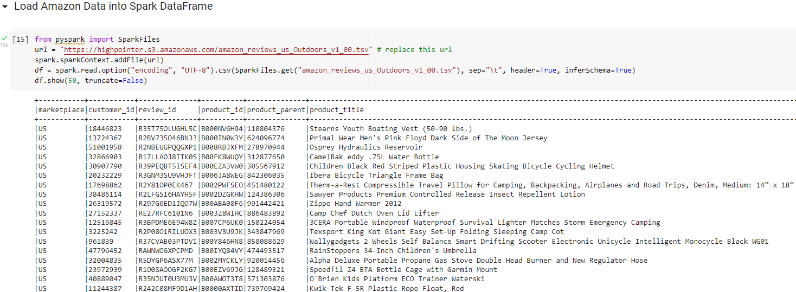
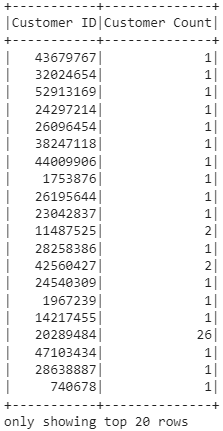
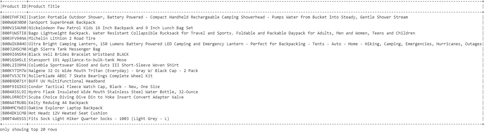

# Amazon_Vine_Analysis
Module 16
(10 points) Here is the Amazon Reivew dataset extracted as a DataFrame:

(20 points) Extracted dataset transformed into four DataFrames
Customers Table:

Products Table:

