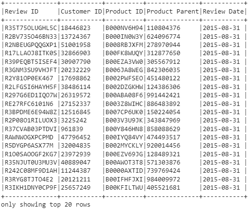
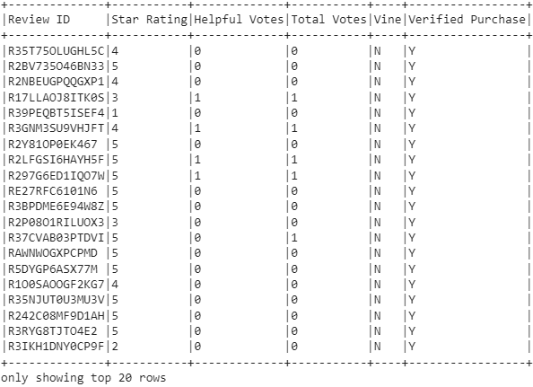
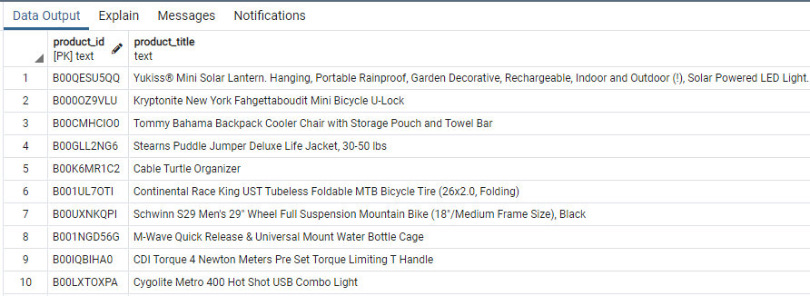
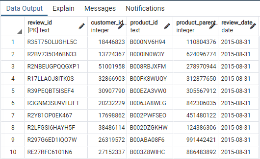
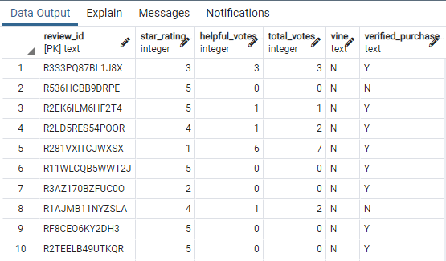

# Amazon_Vine_Analysis: Module 16
## Deliverable 1
### (10 points) Here is the Amazon Review dataset extracted as a DataFrame

### (20 points) Extracted dataset transformed into four DataFrames
##### Customers Table:

##### Products Table:

##### Review ID Table:

##### Vine Table:

### (20 points) Four DataFrames loaded into respective tables in pgAdmin
###### Customers Table in pgAdmin (first 10 rows):

###### Products Table in pgAdmin (first 10 rows):

###### Review ID Table in pgAdmin (first 10 rows):

###### Vine Table in pgAdmin (first 10 rows):

