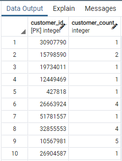
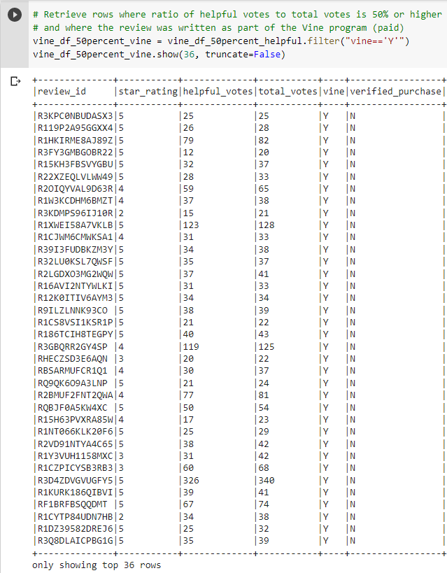

# Amazon_Vine_Analysis: Module 16
## Deliverable 1: Perform ETL on Amazon Product Reviews (40 points)
### (10 points) Here is the Amazon Review dataset extracted as a DataFrame

### (20 points) Extracted dataset transformed into four DataFrames
##### Customers Table:

##### Products Table:

##### Review ID Table:

##### Vine Table:

### (20 points) Four DataFrames loaded into respective tables in pgAdmin
###### Customers Table in pgAdmin (first 10 rows):

###### Products Table in pgAdmin (first 10 rows):

###### Review ID Table in pgAdmin (first 10 rows):

###### Vine Table in pgAdmin (first 10 rows):

## Deliverable 2: Determine Bias of Vine Reviews (40 points)
##### Filtered Vine table with 20 or more votes:

##### Filtered Vine table with 20 or more votes, and ratio of helpful votes to total votes is greater than or equal to 50%:

##### Filtered Vine table where review is paid (written as part of Vine program):

##### Filtered Vine table where review is unpaid (not written as part of Vine program):

##### Comparison of paid (Vine) reviews versus unpaid reviews:
  

The table on the left shows that there were 107 paid reviews that were part of the Vine program. Of these 107 reviews, 56, or 52.3%, were 5-star reviews.
The table on the right shows that there were 39,869 unpaid reviews. Of these 39,869 reviews, 21,005, or 52.7%, were 5-star reviews.
## Deliverable 3: A Written Report on the Analysis (20 points)
The purpose of this analysis was to analyze the results of reviews of Amazon's Outdoor dataset, comparing reviews of the paid Vine program with reviews submitted by unpaid reviewers.

In the Outdoor dataset, there were 
